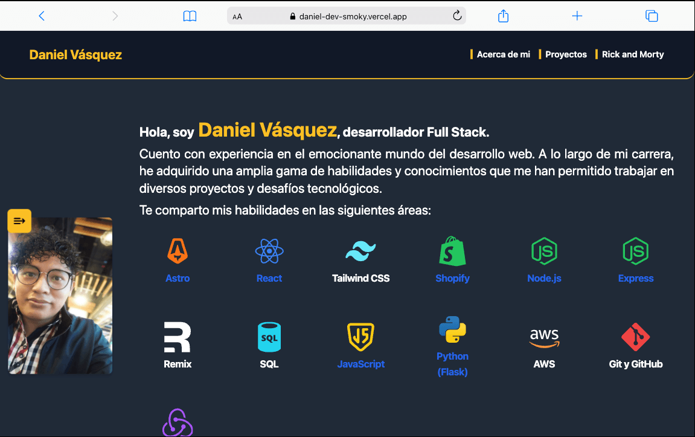

# Daniel Vásquez

¡Bienvenido a mi portafolio web! Aquí podrás explorar mis proyectos, habilidades y las tecnologías que he dominado a lo largo de mi carrera y formación profesional.

El portafolio se divide en tres secciones principales: la primera incluye mi información personal, la segunda muestra mis proyectos y la última destaca un proyecto destacado.

Desarrollado con **Astro**, **TypeScript**, **JavaScript** y **Tailwind CSS**, el diseño se destaca por su estilo minimalista y funcional.

## Ofrezco accesos directos a:

- Perfil de **LinkedIn**
- Perfil de **GitHub**
- Envio de mensaje por **WhatsApp**
- Descarga de **CV**

Cada icono y logo está completamente personalizado en color y tamaño, siendo cada uno un componente React único.

Las imágenes y GIF están optimizadas para una carga rápida y eficiente.

Para una experiencia fluida en dispositivos móviles, el portafolio incluye un menú accesible gracias a la librería **[Headless UI](https://headlessui.com/)**.
